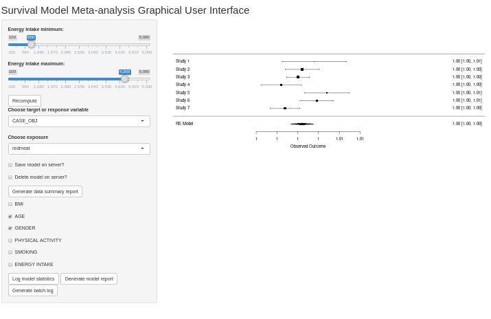

Graphical user interface (GUI) for privacy preserving survival model meta-analysis using the DataSHIELD platform. This uses the R shiny framework for federated meta-analysis of survival models.

* inst/shinyApp

    * folder with all R files
    

* installer_R.R and installer_unix.sh

    * installation scripts in R and UNIX
    
* RUN.R

    * script to start shiny server
    
    * R --no-save < RUN.R
   
* vignettes

   * tutorials and vignettes
   
* NAMESPACE, DESCRIPTION

   * files for package
   
* Dockerfile, shiny-server.conf, shiny-server.sh

   * files for Docker and vagrant
   
   * adapted from
   
      * https://github.com/isglobal-brge/ShinyDataSHIELD
   
   * see the following for more on how to run and compile
   
      * https://blog.zenika.com/2014/10/07/setting-up-a-development-environment-using-docker-and-vagrant/
      
      * https://data2knowledge.atlassian.net/wiki/spaces/DSDEV/pages/367656962/Vagrant
      
      * https://data2knowledge.atlassian.net/wiki/spaces/DSDEV/pages/12943447/Build+your+own+DataSHIELD+VMs
      
* Link to demo website 

     * Demo GUI shiny server
 
        * forthcoming
	
     * Demo VM running on Cambridge server
     
        * Forthcoming 	
     
     * Opal server
      
     	* https://opal-demo.obiba.org/ui/index.html#!admin 
	
    
     * Synthetic data
     
        * Forthcoming 

* Usage

	* install ShinySurvivalDataSHIELD package, load package and run
	
	 ```
	
		install.packages('devtools')
		
		library(devtools)
		
		devtools::install_github('neelsoumya/dsSurvivalShiny')
			
		library(dsSurvivalShiny)
	
		dsSurvivalShiny::app()
		
		OR
		
		R --no-save < installer_R.R
		
		R --no-save < RUN.R
	

* Screenshot of graphical user interface

	
		
* Writeup

   * Forthcoming	

* Citation

   * Forthcoming

* Contact
 
   * Soumya Banerjee, Tom Bishop and DataSHIELD technical team
   
   * https://github.com/neelsoumya/dsSurvivalShiny
   

